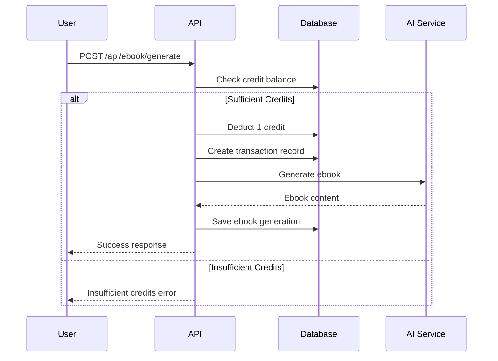
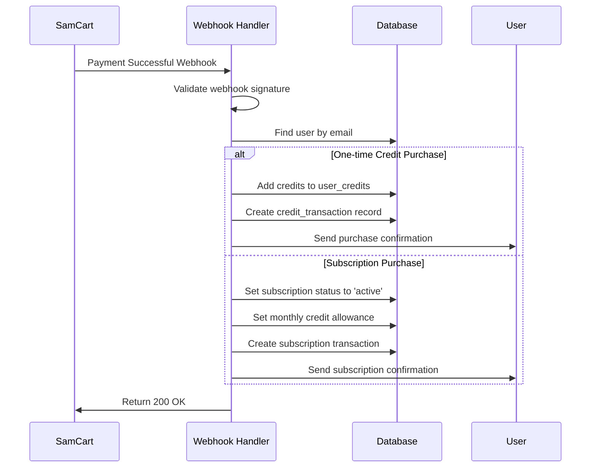
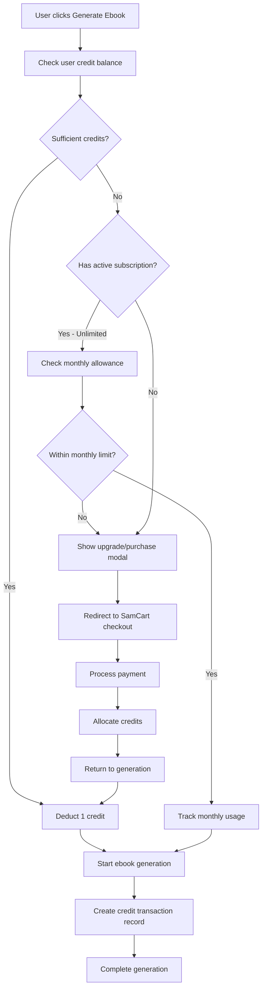
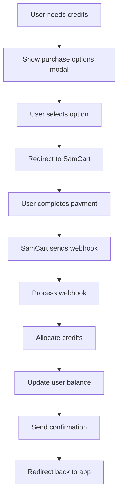
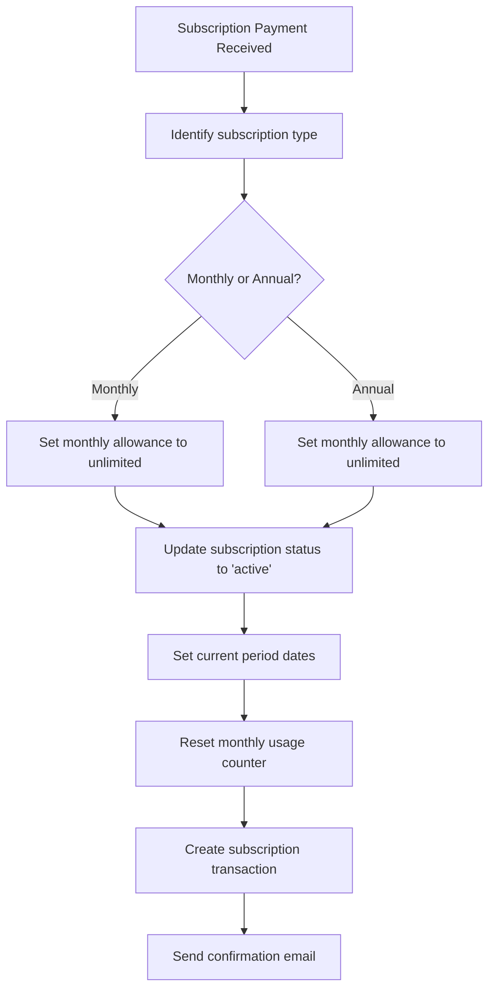

# 🏗️ **Phase 1A Architecture: Credit System & Enhanced SamCart Integration**

**Status: PLANNED** | **Priority: CRITICAL** | **Timeline: 1-2 days**

## **📋 Executive Summary**

This document outlines the complete architectural design for Phase 1A of the Enhanced E-Book Generation System, focusing on implementing a robust credit system with SamCart checkout integration. The system supports a hybrid monetization model with individual credit purchases, bundle pricing, and subscription plans, seamlessly integrating with the existing ebook generation workflow.

## **🎯 Goals & Requirements**

### **Primary Objectives**
- Implement a credit-based monetization system ($2.99 per ebook)
- Support bundle pricing (3 credits for $7.99, 5 credits for $12.99)
- Enable subscription plans (monthly $9.99, annual $89.99)
- Enhance existing SamCart integration with webhook processing
- Provide real-time credit balance tracking and transaction history
- Ensure secure financial transaction handling

### **Success Criteria**
- Credit system accuracy: 100%
- Payment success rate: >95%
- Webhook processing reliability: >99%
- User experience: Seamless credit checking and purchasing flow

## **🗄️ Database Schema Design**

### **1. Credit System Tables**

#### **user_credits Table**
```sql
CREATE TABLE user_credits (
    id UUID PRIMARY KEY DEFAULT gen_random_uuid(),
    user_id UUID REFERENCES profiles(id) ON DELETE CASCADE UNIQUE,
    
    -- Credit balance tracking
    balance INTEGER DEFAULT 0 NOT NULL CHECK (balance >= 0),
    total_earned INTEGER DEFAULT 0 NOT NULL,
    total_spent INTEGER DEFAULT 0 NOT NULL,
    
    -- Subscription information
    subscription_status subscription_status DEFAULT 'none',
    subscription_type subscription_type DEFAULT NULL,
    subscription_starts_at TIMESTAMP DEFAULT NULL,
    subscription_expires_at TIMESTAMP DEFAULT NULL,
    monthly_credit_allowance INTEGER DEFAULT 0,
    monthly_credits_used INTEGER DEFAULT 0,
    current_period_start TIMESTAMP DEFAULT NULL,
    current_period_end TIMESTAMP DEFAULT NULL,
    
    -- SamCart integration
    samcart_subscription_id VARCHAR(255) DEFAULT NULL,
    
    -- Timestamps
    created_at TIMESTAMP DEFAULT NOW(),
    updated_at TIMESTAMP DEFAULT NOW()
);
```

#### **credit_transactions Table**
```sql
CREATE TABLE credit_transactions (
    id UUID PRIMARY KEY DEFAULT gen_random_uuid(),
    user_id UUID REFERENCES profiles(id) ON DELETE CASCADE,
    
    -- Transaction details
    amount INTEGER NOT NULL, -- positive for credits earned, negative for credits spent
    transaction_type transaction_type NOT NULL,
    description TEXT NOT NULL,
    
    -- Reference information
    reference_id VARCHAR(255), -- SamCart order ID, ebook generation ID, etc.
    samcart_order_id VARCHAR(255),
    ebook_generation_id UUID,
    
    -- Transaction metadata
    metadata JSONB DEFAULT '{}',
    
    -- Balance after transaction (for audit trail)
    balance_after_transaction INTEGER NOT NULL,
    
    -- Timestamps
    created_at TIMESTAMP DEFAULT NOW()
);
```

#### **Database Enums**
```sql
-- Subscription status tracking
CREATE TYPE subscription_status AS ENUM (
    'none', 'active', 'cancelled', 'expired', 'past_due'
);

-- Subscription billing cycles
CREATE TYPE subscription_type AS ENUM (
    'monthly', 'annual'
);

-- Credit transaction types
CREATE TYPE transaction_type AS ENUM (
    'purchase_single', 'purchase_bundle_3', 'purchase_bundle_5',
    'subscription_monthly', 'subscription_annual', 'subscription_renewal',
    'ebook_generation', 'refund', 'adjustment', 'monthly_allocation'
);
```

#### **Performance Indexes**
```sql
-- Credit system indexes
CREATE INDEX idx_user_credits_user_id ON user_credits(user_id);
CREATE INDEX idx_user_credits_subscription_status ON user_credits(subscription_status);
CREATE INDEX idx_user_credits_subscription_expires ON user_credits(subscription_expires_at);

-- Transaction indexes
CREATE INDEX idx_credit_transactions_user_id ON credit_transactions(user_id);
CREATE INDEX idx_credit_transactions_type ON credit_transactions(transaction_type);
CREATE INDEX idx_credit_transactions_created_at ON credit_transactions(created_at DESC);
CREATE INDEX idx_credit_transactions_reference_id ON credit_transactions(reference_id);
```

### **2. Enhanced Existing Tables**

#### **ebook_generations Enhancement**
```sql
-- Add credit tracking to existing ebook generations
ALTER TABLE ebook_generations ADD COLUMN IF NOT EXISTS 
    credits_used INTEGER DEFAULT 1,
    generation_cost_cents INTEGER DEFAULT 299, -- $2.99 in cents
    paid_with_credits BOOLEAN DEFAULT true,
    transaction_id UUID REFERENCES credit_transactions(id);

-- Index for credit tracking
CREATE INDEX idx_ebook_generations_transaction_id ON ebook_generations(transaction_id);
```

## **🔌 API Architecture Design**

### **Credit Management API Endpoints**

#### **GET /api/credits/balance**
Check user's current credit balance and subscription status.

**Response:**
```typescript
interface CreditBalanceResponse {
  success: boolean;
  data: {
    balance: number;
    subscription: {
      status: 'none' | 'active' | 'cancelled' | 'expired' | 'past_due';
      type?: 'monthly' | 'annual';
      monthly_allowance?: number;
      monthly_used?: number;
      expires_at?: string;
      current_period_end?: string;
    };
    recent_transactions: CreditTransaction[];
  };
}
```

#### **POST /api/credits/check-sufficient**
Validate if user has sufficient credits for an operation.

**Request:**
```typescript
interface CheckSufficientCreditsRequest {
  credits_required: number;
  operation_type: 'ebook_generation';
}
```

**Response:**
```typescript
interface CheckSufficientCreditsResponse {
  success: boolean;
  data: {
    sufficient: boolean;
    current_balance: number;
    credits_required: number;
    credits_needed?: number;
    purchase_options?: PurchaseOption[];
  };
}
```

#### **POST /api/credits/deduct**
Deduct credits for ebook generation (internal use).

**Request:**
```typescript
interface DeductCreditsRequest {
  amount: number;
  description: string;
  reference_id?: string;
  ebook_generation_id?: string;
  metadata?: Record<string, any>;
}
```

#### **GET /api/credits/transactions**
Retrieve user's credit transaction history.

**Query Parameters:**
- `limit`: Number of transactions to return (default: 20)
- `offset`: Pagination offset
- `type`: Filter by transaction type

### **Ebook Generation API Enhancement**

#### **POST /api/ebook/generate**
Enhanced ebook generation with credit validation.

**Flow:**


## **🛒 Enhanced SamCart Integration**

### **Product Configuration**

#### **SamCart Product Mapping**
```typescript
interface SamCartProduct {
  id: string;
  name: string;
  price: number;
  credits_allocated: number;
  product_type: 'one_time' | 'subscription';
  subscription_details?: {
    billing_cycle: 'monthly' | 'annual';
    monthly_credit_allowance: number;
  };
}

const SAMCART_PRODUCTS: SamCartProduct[] = [
  {
    id: 'single-credit-299',
    name: 'Single E-Book Credit',
    price: 2.99,
    credits_allocated: 1,
    product_type: 'one_time'
  },
  {
    id: 'credit-bundle-3-799',
    name: '3 E-Book Credits Bundle',
    price: 7.99,
    credits_allocated: 3,
    product_type: 'one_time'
  },
  {
    id: 'credit-bundle-5-1299',
    name: '5 E-Book Credits Bundle',
    price: 12.99,
    credits_allocated: 5,
    product_type: 'one_time'
  },
  {
    id: 'monthly-unlimited-999',
    name: 'Monthly Unlimited Plan',
    price: 9.99,
    credits_allocated: 0, // Unlimited
    product_type: 'subscription',
    subscription_details: {
      billing_cycle: 'monthly',
      monthly_credit_allowance: -1 // -1 = unlimited
    }
  },
  {
    id: 'annual-unlimited-8999',
    name: 'Annual Unlimited Plan',
    price: 89.99,
    credits_allocated: 0, // Unlimited
    product_type: 'subscription',
    subscription_details: {
      billing_cycle: 'annual',
      monthly_credit_allowance: -1 // -1 = unlimited
    }
  }
];
```

### **Enhanced Webhook Processing**

#### **POST /api/webhooks/samcart**
Process SamCart payment webhooks and allocate credits.

**Webhook Flow:**


#### **Webhook Event Handlers**

**Order (One-time Purchase):**
```typescript
async function handleNewOrder(supabase: SupabaseClient, payload: SamCartWebhookPayload) {
  const product = SAMCART_PRODUCTS.find(p => p.id === payload.product.id);
  
  if (product?.product_type === 'one_time') {
    // Add credits to user account
    await allocateCredits({
      user_email: payload.customer.email,
      amount: product.credits_allocated,
      transaction_type: getTransactionType(product.id),
      samcart_order_id: payload.order.id.toString(),
      reference_id: payload.order.id.toString()
    });
  }
}
```

**Subscription Events:**
```typescript
async function handleSubscriptionPayment(supabase: SupabaseClient, payload: SamCartWebhookPayload) {
  const product = SAMCART_PRODUCTS.find(p => p.id === payload.product.id);
  
  if (product?.product_type === 'subscription') {
    await updateSubscriptionStatus({
      user_email: payload.customer.email,
      status: 'active',
      type: product.subscription_details.billing_cycle,
      monthly_allowance: product.subscription_details.monthly_credit_allowance,
      samcart_subscription_id: payload.order.subscription_id?.toString()
    });
  }
}
```

## **🔄 Credit System Workflows**

### **Ebook Generation with Credit Check**



### **Credit Purchase Flow**



### **Subscription Management**



## **🛡️ Security & Error Handling Strategy**

### **Financial Transaction Security**

#### **Input Validation**
```typescript
class CreditSystemValidator {
  static validateCreditAmount(amount: number): void {
    if (!Number.isInteger(amount) || amount <= 0) {
      throw new Error('Credit amount must be a positive integer');
    }
    if (amount > 1000) {
      throw new Error('Credit amount exceeds maximum allowed');
    }
  }

  static validateWebhookSignature(payload: string, signature: string): boolean {
    // Implement SamCart webhook signature validation
    const expectedSignature = crypto
      .createHmac('sha256', process.env.SAMCART_WEBHOOK_SECRET)
      .update(payload)
      .digest('hex');
    
    return crypto.timingSafeEqual(
      Buffer.from(signature, 'hex'),
      Buffer.from(expectedSignature, 'hex')
    );
  }
}
```

#### **Database Integrity**
```sql
-- Trigger to maintain credit balance integrity
CREATE OR REPLACE FUNCTION maintain_credit_balance()
RETURNS TRIGGER AS $$
BEGIN
    -- Recalculate balance after each transaction
    UPDATE user_credits 
    SET balance = (
        SELECT COALESCE(SUM(amount), 0) 
        FROM credit_transactions 
        WHERE user_id = NEW.user_id
    )
    WHERE user_id = NEW.user_id;
    
    RETURN NEW;
END;
$$ LANGUAGE plpgsql;

CREATE TRIGGER trigger_maintain_credit_balance
    AFTER INSERT ON credit_transactions
    FOR EACH ROW EXECUTE FUNCTION maintain_credit_balance();
```

### **Error Handling Specifications**

#### **Credit System Errors**
```typescript
enum CreditSystemErrors {
  INSUFFICIENT_CREDITS = 'INSUFFICIENT_CREDITS',
  PAYMENT_PROCESSING_ERROR = 'PAYMENT_PROCESSING_ERROR',
  SUBSCRIPTION_EXPIRED = 'SUBSCRIPTION_EXPIRED',
  INVALID_TRANSACTION = 'INVALID_TRANSACTION',
  WEBHOOK_VALIDATION_FAILED = 'WEBHOOK_VALIDATION_FAILED'
}

interface ErrorResponse {
  code: CreditSystemErrors;
  message: string;
  recovery_actions: string[];
  support_contact?: string;
}

const ERROR_RESPONSES: Record<CreditSystemErrors, ErrorResponse> = {
  [CreditSystemErrors.INSUFFICIENT_CREDITS]: {
    code: CreditSystemErrors.INSUFFICIENT_CREDITS,
    message: 'Not enough credits to complete this operation',
    recovery_actions: ['purchase_credits', 'upgrade_subscription']
  },
  [CreditSystemErrors.PAYMENT_PROCESSING_ERROR]: {
    code: CreditSystemErrors.PAYMENT_PROCESSING_ERROR,
    message: 'Payment could not be processed',
    recovery_actions: ['retry_payment', 'contact_support']
  },
  [CreditSystemErrors.SUBSCRIPTION_EXPIRED]: {
    code: CreditSystemErrors.SUBSCRIPTION_EXPIRED,
    message: 'Your subscription has expired',
    recovery_actions: ['renew_subscription', 'purchase_credits']
  }
};
```

#### **Failed Payment Handling**
```typescript
interface FailedPaymentHandler {
  async handleFailedPayment(webhookData: SamCartWebhook): Promise<void> {
    // Log failed payment attempt
    await this.logFailedPayment(webhookData);
    
    // If subscription payment failed
    if (webhookData.type === 'RecurringPaymentFailed') {
      // Mark subscription as past_due
      await this.updateSubscriptionStatus(webhookData.customer.email, 'past_due');
      
      // Send payment retry notification
      await this.sendPaymentRetryNotification(webhookData.customer.email);
      
      // Set grace period (7 days) before disabling access
      await this.setGracePeriod(webhookData.customer.email, 7);
    }
  }

  async handleRefund(webhookData: SamCartWebhook): Promise<void> {
    // Reverse credit allocation
    const originalTransaction = await this.findTransactionByOrderId(
      webhookData.order.id.toString()
    );
    
    if (originalTransaction) {
      await this.createRefundTransaction({
        user_id: originalTransaction.user_id,
        amount: -originalTransaction.amount, // Negative to reverse
        reference_id: webhookData.refund_transaction_id,
        description: `Refund for order ${webhookData.order.id}`
      });
    }
  }
}
```

## **🔗 Integration Points with Existing Codebase**

### **Enhanced Components**

#### **1. EbookGenerator Component Updates**
```typescript
// Add to existing EbookGenerator component
const EbookGenerator = ({ originalStory, storyId }: EbookGeneratorProps) => {
  const [creditBalance, setCreditBalance] = useState<number>(0);
  const [showPurchaseModal, setShowPurchaseModal] = useState(false);

  const checkCreditsBeforeGeneration = async () => {
    const response = await fetch('/api/credits/check-sufficient', {
      method: 'POST',
      headers: { 'Content-Type': 'application/json' },
      body: JSON.stringify({ credits_required: 1, operation_type: 'ebook_generation' })
    });
    
    const data = await response.json();
    
    if (!data.data.sufficient) {
      setShowPurchaseModal(true);
      return false;
    }
    
    return true;
  };

  const generateChaptersFromStory = async () => {
    const hasCredits = await checkCreditsBeforeGeneration();
    if (!hasCredits) return;
    
    // Proceed with existing generation logic
    // ... existing code
  };
};
```

#### **2. New Components Required**

**CreditBalanceWidget:**
```typescript
interface CreditBalanceWidgetProps {
  userId: string;
  onPurchaseClick: () => void;
}

const CreditBalanceWidget: React.FC<CreditBalanceWidgetProps> = ({ userId, onPurchaseClick }) => {
  const [balance, setBalance] = useState<number>(0);
  const [subscription, setSubscription] = useState<SubscriptionInfo | null>(null);

  return (
    <Card className="p-4">
      <div className="flex items-center justify-between">
        <div className="flex items-center space-x-2">
          <CreditCard className="h-5 w-5 text-blue-500" />
          <span className="font-medium">Credits</span>
        </div>
        <div className="text-right">
          {subscription?.status === 'active' ? (
            <Badge variant="success">Unlimited</Badge>
          ) : (
            <span className="text-2xl font-bold">{balance}</span>
          )}
        </div>
      </div>
      {subscription?.status !== 'active' && balance < 1 && (
        <Button onClick={onPurchaseClick} className="w-full mt-2" size="sm">
          Purchase Credits
        </Button>
      )}
    </Card>
  );
};
```

**PurchaseCreditsModal:**
```typescript
const PurchaseCreditsModal: React.FC<PurchaseCreditsModalProps> = ({ isOpen, onClose }) => {
  const purchaseOptions = [
    { id: 'single-credit-299', name: '1 Credit', price: 2.99, credits: 1 },
    { id: 'credit-bundle-3-799', name: '3 Credits', price: 7.99, credits: 3, savings: '$1.00' },
    { id: 'credit-bundle-5-1299', name: '5 Credits', price: 12.99, credits: 5, savings: '$2.00' },
    { id: 'monthly-unlimited-999', name: 'Monthly Unlimited', price: 9.99, type: 'subscription' },
    { id: 'annual-unlimited-8999', name: 'Annual Unlimited', price: 89.99, type: 'subscription' }
  ];

  const handlePurchase = (productId: string) => {
    samcartClient.redirectToCheckout({
      productId,
      redirectUrl: `${window.location.origin}/checkout/success`,
      cancelUrl: window.location.href
    });
  };

  return (
    <Dialog open={isOpen} onOpenChange={onClose}>
      {/* Modal content with purchase options */}
    </Dialog>
  );
};
```

### **Database Migration Scripts**

#### **Migration 001: Create Credit System**
```sql
-- File: supabase/migrations/001_create_credit_system.sql
BEGIN;

-- Create enums
CREATE TYPE subscription_status AS ENUM ('none', 'active', 'cancelled', 'expired', 'past_due');
CREATE TYPE subscription_type AS ENUM ('monthly', 'annual');
CREATE TYPE transaction_type AS ENUM (
  'purchase_single', 'purchase_bundle_3', 'purchase_bundle_5',
  'subscription_monthly', 'subscription_annual', 'subscription_renewal',
  'ebook_generation', 'refund', 'adjustment', 'monthly_allocation'
);

-- Create user_credits table
CREATE TABLE user_credits (
  id UUID PRIMARY KEY DEFAULT gen_random_uuid(),
  user_id UUID REFERENCES profiles(id) ON DELETE CASCADE UNIQUE,
  balance INTEGER DEFAULT 0 NOT NULL CHECK (balance >= 0),
  total_earned INTEGER DEFAULT 0 NOT NULL,
  total_spent INTEGER DEFAULT 0 NOT NULL,
  subscription_status subscription_status DEFAULT 'none',
  subscription_type subscription_type DEFAULT NULL,
  subscription_starts_at TIMESTAMP DEFAULT NULL,
  subscription_expires_at TIMESTAMP DEFAULT NULL,
  monthly_credit_allowance INTEGER DEFAULT 0,
  monthly_credits_used INTEGER DEFAULT 0,
  current_period_start TIMESTAMP DEFAULT NULL,
  current_period_end TIMESTAMP DEFAULT NULL,
  samcart_subscription_id VARCHAR(255) DEFAULT NULL,
  created_at TIMESTAMP DEFAULT NOW(),
  updated_at TIMESTAMP DEFAULT NOW()
);

-- Create credit_transactions table
CREATE TABLE credit_transactions (
  id UUID PRIMARY KEY DEFAULT gen_random_uuid(),
  user_id UUID REFERENCES profiles(id) ON DELETE CASCADE,
  amount INTEGER NOT NULL,
  transaction_type transaction_type NOT NULL,
  description TEXT NOT NULL,
  reference_id VARCHAR(255),
  samcart_order_id VARCHAR(255),
  ebook_generation_id UUID,
  metadata JSONB DEFAULT '{}',
  balance_after_transaction INTEGER NOT NULL,
  created_at TIMESTAMP DEFAULT NOW()
);

-- Create indexes
CREATE INDEX idx_user_credits_user_id ON user_credits(user_id);
CREATE INDEX idx_user_credits_subscription_status ON user_credits(subscription_status);
CREATE INDEX idx_user_credits_subscription_expires ON user_credits(subscription_expires_at);

CREATE INDEX idx_credit_transactions_user_id ON credit_transactions(user_id);
CREATE INDEX idx_credit_transactions_type ON credit_transactions(transaction_type);
CREATE INDEX idx_credit_transactions_created_at ON credit_transactions(created_at DESC);
CREATE INDEX idx_credit_transactions_reference_id ON credit_transactions(reference_id);

-- Create triggers for data integrity
CREATE OR REPLACE FUNCTION update_user_credits_updated_at()
RETURNS TRIGGER AS $$
BEGIN
    NEW.updated_at = NOW();
    RETURN NEW;
END;
$$ language 'plpgsql';

CREATE TRIGGER trigger_user_credits_updated_at
    BEFORE UPDATE ON user_credits
    FOR EACH ROW EXECUTE FUNCTION update_user_credits_updated_at();

COMMIT;
```

#### **Migration 002: Enhance Ebook Generations**
```sql
-- File: supabase/migrations/002_enhance_ebook_generations.sql
BEGIN;

-- Add credit tracking to ebook generations
ALTER TABLE ebook_generations ADD COLUMN IF NOT EXISTS 
    credits_used INTEGER DEFAULT 1,
    generation_cost_cents INTEGER DEFAULT 299,
    paid_with_credits BOOLEAN DEFAULT true,
    transaction_id UUID REFERENCES credit_transactions(id);

-- Create index
CREATE INDEX idx_ebook_generations_transaction_id ON ebook_generations(transaction_id);

COMMIT;
```

## **📊 Implementation Timeline**

### **Day 1: Database & Core API**
- [ ] Create database migration scripts
- [ ] Implement credit system database tables
- [ ] Build core credit management API endpoints
- [ ] Create credit allocation and deduction functions
- [ ] Implement basic error handling

### **Day 2: SamCart Integration & UI**
- [ ] Enhance SamCart webhook processing
- [ ] Create separate product configurations
- [ ] Build credit balance widget component
- [ ] Implement purchase credits modal
- [ ] Integrate credit checking into ebook generation
- [ ] Add subscription status management

### **Testing & Validation**
- [ ] Unit tests for credit calculations
- [ ] Integration tests for webhook processing
- [ ] End-to-end testing of purchase flow
- [ ] Security validation of financial transactions

## **🎯 Success Metrics**

### **Technical KPIs**
- [ ] Credit system accuracy: 100%
- [ ] Payment success rate: >95%
- [ ] Webhook processing reliability: >99%
- [ ] API response time: <200ms for credit operations

### **Business KPIs**
- [ ] Conversion rate from free to paid: >15%
- [ ] Average revenue per user (ARPU): >$5
- [ ] Customer satisfaction with payment flow: >4.5/5
- [ ] Subscription retention rate: >80%

## **🚀 Next Steps**

Once Phase 1A is implemented:

1. **Phase 1B**: Taylor Swift-themed story generation
2. **Phase 1C**: Fast streaming UI with polish
3. **Phase 1D**: Thematic image generation
4. **Phase 1E**: Book-style presentation

---

**This architecture provides a robust, scalable foundation for the credit system while maintaining clean separation of concerns and strong integration with the existing SamCart payment system. The hybrid model supports both one-time purchases and subscriptions, with comprehensive transaction tracking and error handling.**